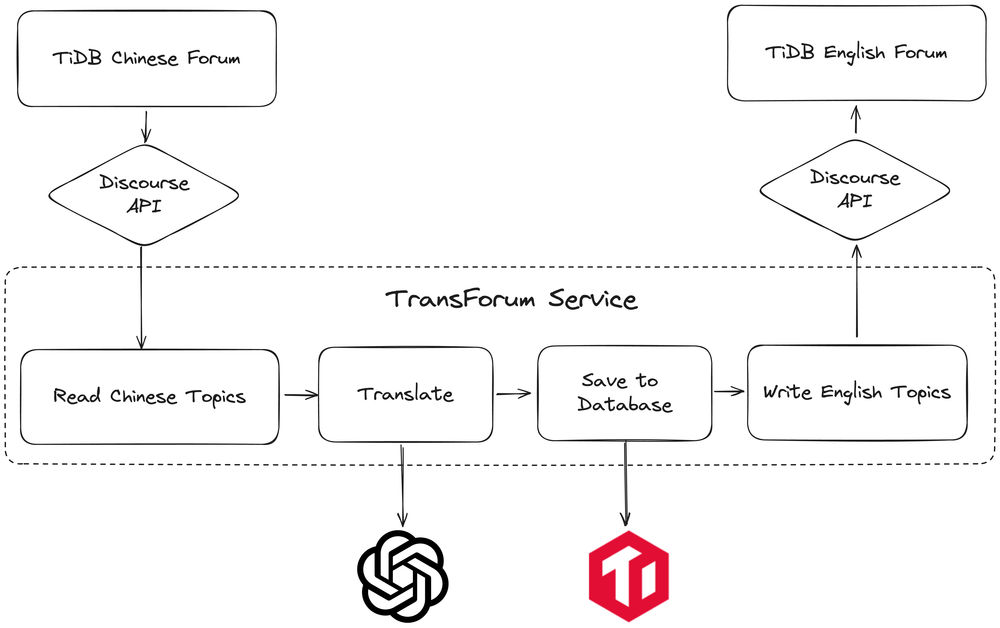

# TransForum

TransForum automates the translation of content from the [TiDB Chinese Forum](https://asktug.com/) to the [TiDB English Forum](https://ask.pingcap.com/).



## Deployment

1. **Environment Configuration:**
   Create a `.env` file with the following variables or set them through your environment:

    ```property
    DEBUG=False
    TIDB_HOST='gateway**.**-****-*.prod.aws.tidbcloud.com'
    TIDB_PORT=4000
    TIDB_USER='**********'
    TIDB_PASSWORD='***********'
    TIDB_DB_NAME='******'
    OPEN_AI_API='sk-*****************'
    OPEN_AI_BASE_URL='https://api.openai.com/v1'
    EN_DISCOURSE_HOST='https://ask.pingcap.com/'
    EN_DISCOURSE_API_USERNAME='****'
    EN_DISCOURSE_API_KEY='**********'
    EN_DISCOURSE_CATEGORY_ID='**'
    ```

2. **Docker Configuration:**
   Set up your Docker environment using the provided `docker-compose.yml`:

    ```yaml
    version: "3"
    services:
      transforum:
        image: cheesewong/trans-forum:latest
        ports:
          - 4000:4000
        environment:
          DEBUG: "${DEBUG}"
          TIDB_HOST: "${TIDB_HOST}"
          TIDB_PORT: "${TIDB_PORT}"
          TIDB_USER: "${TIDB_USER}"
          TIDB_PASSWORD: "${TIDB_PASSWORD}"
          TIDB_DB_NAME: "${TIDB_DB_NAME}"
          OPEN_AI_API: "${OPEN_AI_API}"
          OPEN_AI_BASE_URL: "${OPEN_AI_BASE_URL}"
          EN_DISCOURSE_HOST: "${EN_DISCOURSE_HOST}"
          EN_DISCOURSE_API_USERNAME: "${EN_DISCOURSE_API_USERNAME}"
          EN_DISCOURSE_API_KEY: "${EN_DISCOURSE_API_KEY}"
          EN_DISCOURSE_CATEGORY_ID: "${EN_DISCOURSE_CATEGORY_ID}"
    ```

3. **Start the Application:**
   Launch the application with Docker:

   ```bash
   docker compose up -d --force-recreate --pull always
   ```

## Usage

- The service will automatically start synchronizing tasks upon initialization.
- For manual synchronization of specific pages or topics, use the following APIs:

  - **GET `/sync/topic_ids`:** Fetches all topic IDs from the original forum, stores them in the database, and queues them for synchronization.
  - **POST `/topic/task`:** Selects an unsynchronized topic ID, translates it, and publishes it to the English forum. This endpoint depends on `/sync/topic_ids` for topic IDs.
  - **PUT `/topic/{topic_id}`:** Translates and synchronizes a topic by its ID. This endpoint is idempotent, ensuring consistent results with multiple invocations. It also updates translations if the source content has changed.
  - **PUT `/page/{page_id}`:** Synchronizes all topics on a page, similar to the topic endpoint. Pages are ordered by update time, with `page_id` starting from `0`.

## Development

- **Local Setup:**
  Utilize the `.env` settings on your local machine to start the project.

- **Database Classes Generation:**
  Use `python3 manage.py gen-db-classes` to generate or update database instance classes in `app/db/gen_instances.py` based on your database schema.

- **Key Files and Directories:**
  - `manage.py`: Manages database class generation and service startup.
  - `Dockerfile`: Builds the Docker image.
  - `app`: Main code directory.
    - `main.py`: API entry points.
    - `config`: Configuration handling, automatically reads `.env` or environment variables.
    - `db`: Database operations, including SQL scripts and instance generation.
    - `forum`: Forum topic management.
    - `models`: Translation model integration.
    - `service`: Service integration and functionality.
